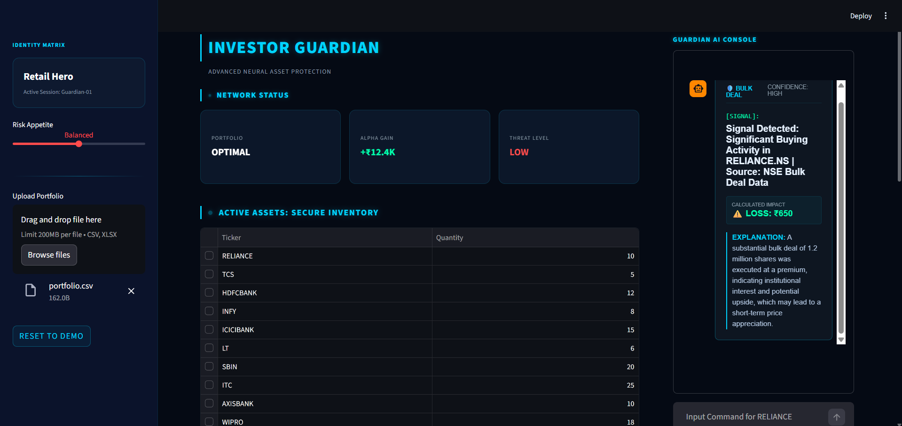
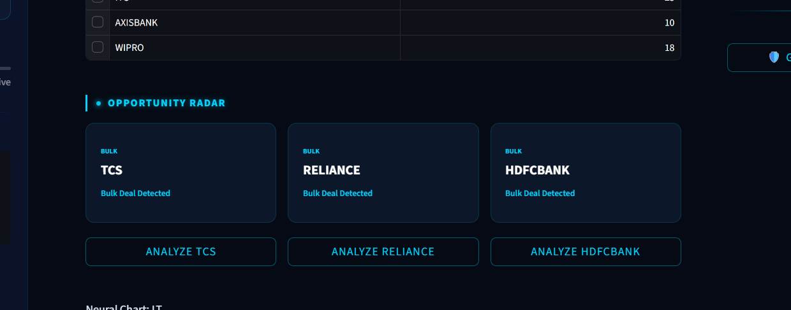
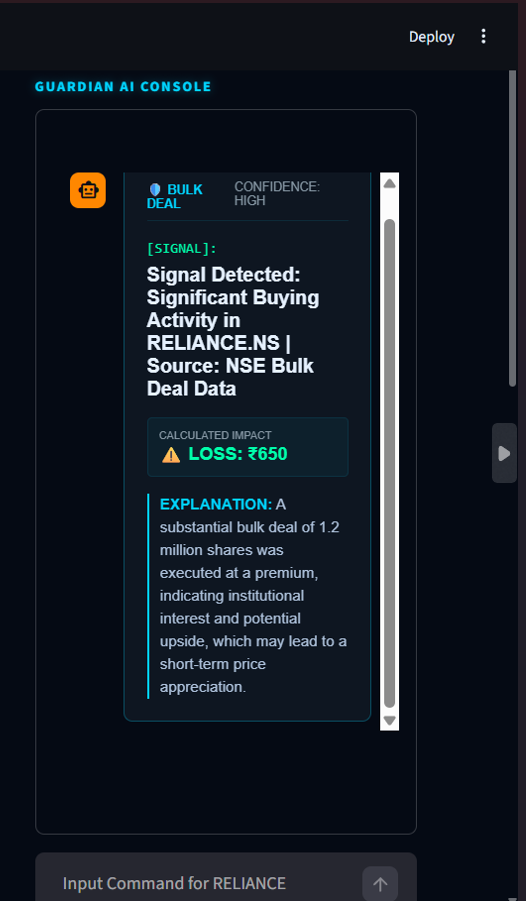
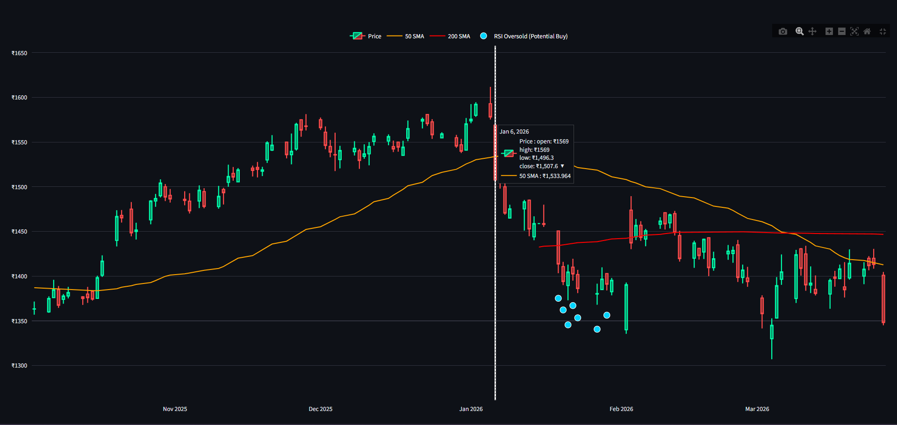

# 🚀 ET Investor Guardian

### AI-Powered Intelligence Layer for Smarter Investing

> **“In investing, the difference between profit and loss is often just one signal you missed.”**
> We make sure you never miss it.

---

## 🧠 Problem

India has **14+ crore demat accounts**, yet most retail investors are still:

* Reacting to tips instead of data
* Missing critical signals (bulk deals, filings, insider activity)
* Struggling to interpret technical indicators
* Unable to connect market events to their **own portfolio**

Despite abundant data, there is **no intelligence layer** that converts it into actionable decisions.

---

## 💡 Solution — ET Investor Guardian

**ET Investor Guardian** is an AI-powered system that transforms raw market data into **clear, actionable, portfolio-specific insights**.

> **Data → Signal → Explanation → ₹ Impact → Decision**

We don’t just show data — we **find what matters**.

---

## 🔄 How It Works

```
Upload Portfolio
        ↓
Opportunity Radar (Signal Detection)
        ↓
AI Analysis (Explanation)
        ↓
Impact Engine (₹ Outcome)
        ↓
AI Chat (Personalized Decisions)
```

---

## ⚡ Key Features

### 📡 Opportunity Radar

Continuously scans market signals like:

* Bulk / Block deals
* Institutional activity
* Market-moving events

Surfaces **high-conviction opportunities** — not just summaries.

---

### 🧠 AI Signal Analysis

* Explains signals in **plain English**
* Answers: *What happened? Why does it matter?*

---

### 💰 Portfolio Impact (USP)

* Shows **real ₹ impact** on your holdings
* Bridges gap between insight → decision

---

### 💬 AI Chat (Next-Gen Market Assistant)

* Portfolio-aware responses
* Ask:

  * “How does this affect my holdings?”
  * “Should I hold or sell?”

---

### 📊 Advanced Charting

* Technical indicators (RSI, Golden Cross)
* Trend visualization

---

### 📂 Portfolio Upload

* Upload CSV
* Instantly analyze holdings

---

## 📸 Screenshots

> Here’s how ET Investor Guardian works in action:

### 🔹 Dashboard Overview



### 🔹 Opportunity Radar (Signal Detection)



### 🔹 AI Signal Analysis



### 🔹 Chart (₹)



---

## 🏗️ Tech Stack

* **Frontend:** Streamlit
* **Backend:** Python
* **Data Sources:** yfinance, nsepython
* **AI Engine:** Groq (LLaMA 3.1)
* **Visualization:** Plotly

---

## ⚙️ Setup Instructions

### 1. Clone the repository

```
git clone https://github.com/khushi347/et-investor-guardian
cd et-investor-guardian
```

### 2. Install dependencies

```
pip install -r requirements.txt
```

### 3. Run the app

```
streamlit run app.py
```

---

## 🏆 Built For

**ET Hackathon — AI for the Indian Investor**

---

## 🚀 Vision

To become the **intelligence layer for retail investors in India**,
transforming investing from guesswork to data-driven decisions.

